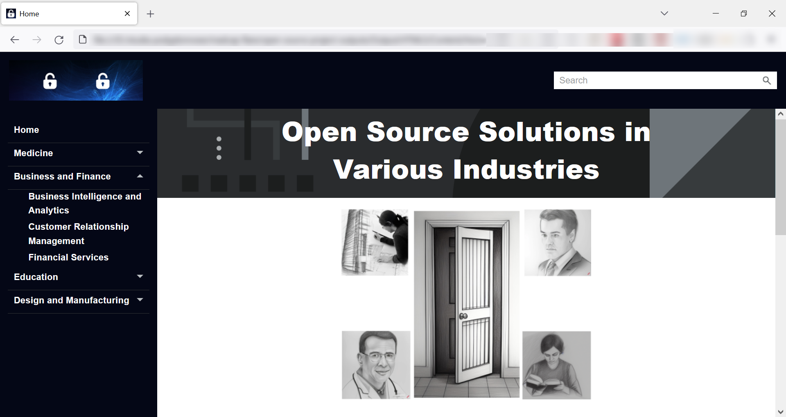
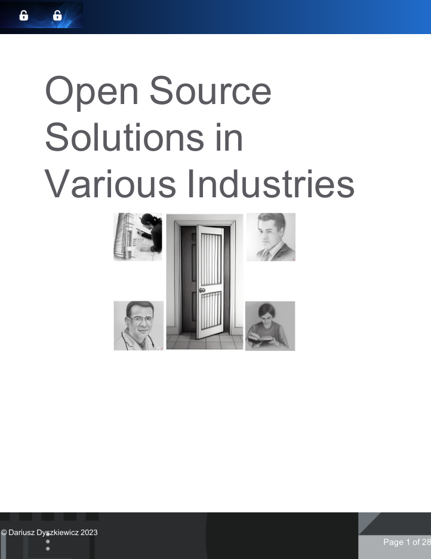

# Portfolio
Greetings 👋 My name is Dariusz Dyszkiewicz. I created this repository to share my projects.

## TechComm, HAT, AI

## MadCap Flare project 1
This project showcases examples of open-source software that can be introduced by organizations across several industries. The contents present a general overview of the benefits and capabilities of these solutions.

For this project, I used __MadCap Flare__ to create outputs in popular formats: PDF and HTML5. I started with the _Side Navigation and PDF Template_ and introduced several modifications to the default page layout, skin and template (master) page, and CSS styles. I added several content elements, including:
* a TOC,
* PDF Proxy and HTML homepage,
* images,
* tables,
* hyperlinks and cross-references,
* conditional tags,
* variables.

I also used a variety of other software and services, including generative AI tools. I created the text contents using __ChatGPT__ (with minor manual revisions). I generated all images using __Stable Diffusion__, __Crayon__, (plus __GIMP__ for the cover page/homepage image), and __Canva__ for the favicon and logo.

| [] | [] | [] | [] | [] |
